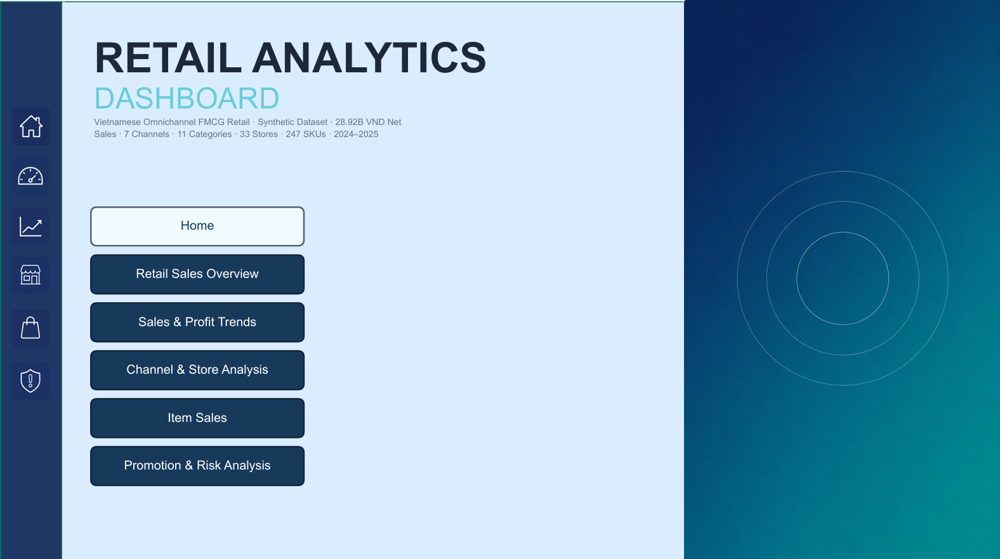
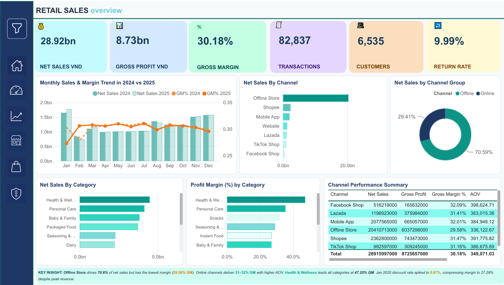
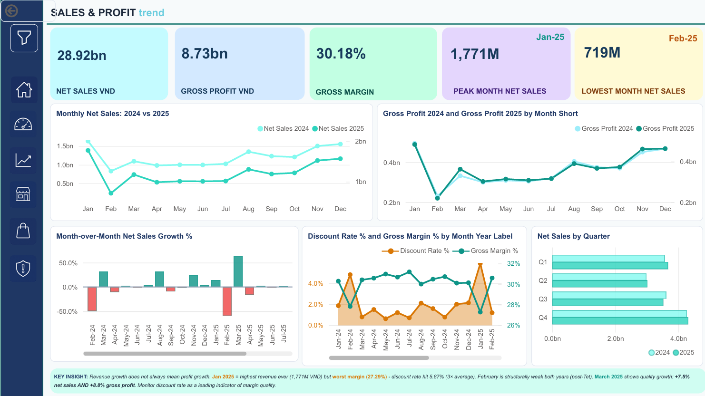
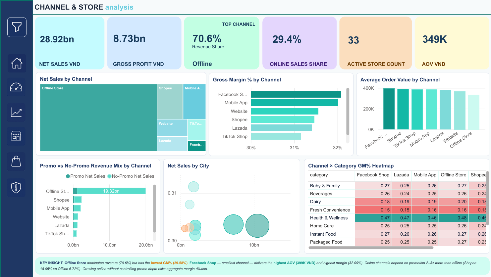
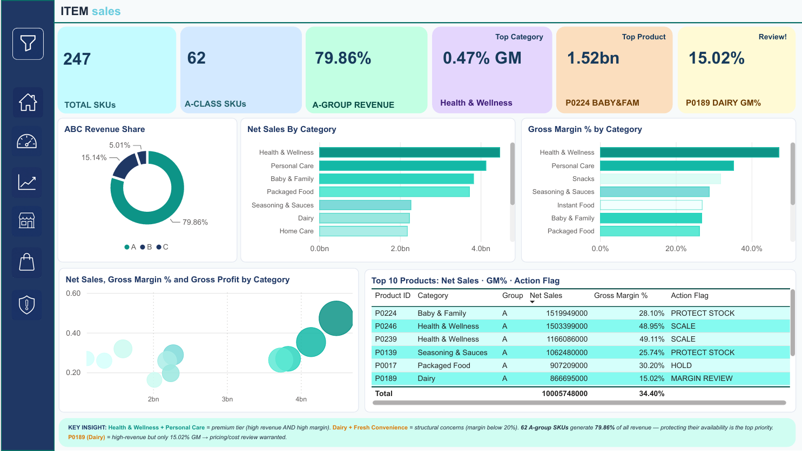
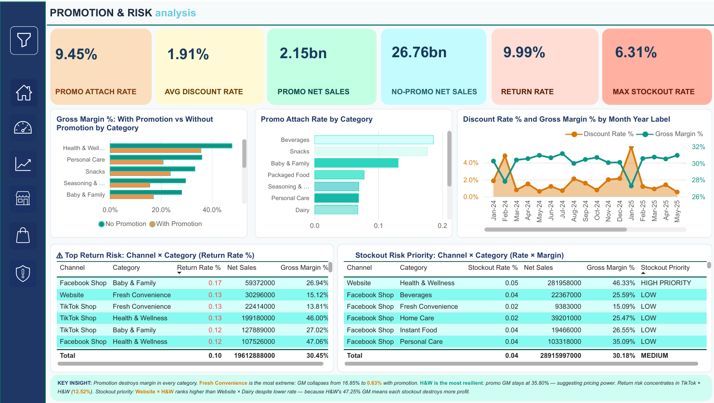

# Vietnam Omnichannel FMCG Retail Analytics

## Project Overview

A 6-page Power BI executive dashboard analyzing sales growth, profitability, channel performance, product contribution, promotion effectiveness, returns, and stockout risk across a synthetic Vietnamese omnichannel FMCG retailer.

The project combines data profiling, auditable SQL-based cleaning, exploratory analysis, business KPI design, and interactive reporting to identify where revenue growth is profitable, where margin is being diluted, and which channel–category combinations require operational attention.

---

## Business Problem

The retailer operates across **7 sales channels, 33 stores, 11 product categories, and 247 SKUs**, but revenue alone does not provide a complete view of business health. Sales growth may be driven by deeper discounts, high-volume channels may generate weaker margins, and return or stockout problems may be concentrated in specific channel–category combinations.

Without a unified analytical view, commercial teams risk prioritizing sales volume while overlooking profit quality, promotion efficiency, product mix, and operational risk.

---

## Business Questions

- Are net sales and gross profit growing together across 2024–2025?
- Which channels, stores, categories, and SKUs contribute the most sales and profit?
- Which channels generate the strongest margin and average order value?
- Do promotions create profitable growth or mainly increase sales through discounting?
- Where are return and stockout risks concentrated?
- Which products should receive the highest commercial and inventory priority?

---

## Dataset

**Source:** Synthetic Vietnamese omnichannel FMCG retail dataset created for analytics practice and portfolio development.

The dataset follows a star-schema structure with one transaction fact table and five dimensions covering products, stores, customers, calendar dates, and promotions.

- **Raw scale:** 187,490 transaction line items
- **Analyzed scale:** 179,575 valid line items and 82,837 orders
- **Customers:** 6,535 purchasing customers
- **Coverage:** 7 channels, 33 stores, 11 categories, and 247 SKUs
- **Analysis period:** January 2024 – December 2025
- **Data note:** No real customer or confidential company data is included

---

## Tools Used

- Power BI
- Power Query
- DAX
- SQL with DuckDB
- Google Colab / Python
- Microsoft Excel

---

## Key Metrics

| Metric | Result |
|---|---:|
| Net Sales | 28.92B VND |
| Gross Profit | 8.73B VND |
| Gross Margin | 30.18% |
| Orders | 82,837 |
| Units Sold | 287,092 |
| Average Order Value | 349,071 VND |
| Return Quantity Rate | 9.61% |
| Promotion Attach Rate | 9.45% |

---

## Key Findings

- **Revenue growth did not fully translate into profit growth.** Net sales increased slightly from **14.41B VND in 2024 to 14.50B VND in 2025**, while gross profit declined slightly and gross margin decreased from **30.31% to 30.05%**.

- **January 2025 generated the highest monthly sales but weaker profit quality.** Net sales reached **1.77B VND**, while gross margin fell to **27.29%** and the discount rate increased to **5.87%**, showing that the strongest sales month was partly discount-driven.

- **Offline Store is the main scale driver but not the strongest-margin channel.** It contributed approximately **70.6% of net sales**, yet recorded the lowest channel gross margin at **29.58%**. Online channels delivered higher margins and AOVs, but relied more heavily on promotions.

- **Promotion effectiveness varies significantly by category.** Fresh Convenience gross margin fell from **16.85% without promotion to 0.63% with promotion**, while Health & Wellness retained a comparatively strong **35.80% promotional margin**.

- **Operational risk is concentrated in specific online combinations.** TikTok Shop × Health & Wellness recorded the highest return rate at **12.52%**, while Website × Dairy recorded the highest stockout rate at **6.31%**.

---

## Business Recommendations

1. **Protect profit quality during promotions** by applying category-specific discount and margin guardrails. Review promotion mechanics for Fresh Convenience, Home Care, and Instant Food, while testing scalable offers in categories that retain stronger margins.

2. **Grow online channels with operational controls**, not sales targets alone. Track return and stockout performance at the channel × category level, with priority based on a combination of risk rate, net sales, and gross margin.

3. **Use product priority beyond revenue ranking** by combining ABC classification with margin, return, and stockout indicators. This helps distinguish products that are commercially important from products that generate high sales but weak profitability or operational risk.

4. **Maintain Offline Store as the scale engine while improving mix quality** through pricing, category mix, and cross-sell analysis, and selectively expand higher-margin online channels such as Shopee and Mobile App.

---

## Dashboard Preview

### Home & Navigation



### Retail Sales Overview



### Sales & Profit Trends



### Channel & Store Analysis



### Item Sales



### Promotion & Risk Analysis



### Report Pages

1. **Home** — project context and report navigation
2. **Retail Sales Overview** — headline KPIs and overall performance
3. **Sales & Profit Trends** — monthly and yearly sales, profit, margin, and growth
4. **Channel & Store Analysis** — channel mix, store performance, and regional comparison
5. **Item Sales** — category, SKU, margin, and ABC product analysis
6. **Promotion & Risk Analysis** — promotion quality, return rate, and stockout risk
### Report Pages

1. **Home** — project context and report navigation
2. **Retail Sales Overview** — headline KPIs and overall performance
3. **Sales & Profit Trends** — monthly and yearly sales, profit, margin, and growth
4. **Channel & Store Analysis** — channel mix, store performance, and regional comparison
5. **Item Sales** — category, SKU, margin, and ABC product analysis
6. **Promotion & Risk Analysis** — promotion quality, return rate, and stockout risk

---

## Technical Highlights

- **Designed a star-schema analytical model** with one transaction fact table and five dimension tables for product, store, customer, calendar, and promotion analysis.

- **Built auditable DuckDB cleaning views** instead of overwriting raw data, preserving original fields while creating cleaned values and correction flags.

- **Resolved major data-quality issues**, including duplicate transaction keys, inconsistent channel and city labels, missing unit prices, invalid return quantities, offline delivery-fee errors, and product launch-date conflicts.

- **Applied SQL CTEs, joins, window functions, ranking, and ABC classification** to calculate distinct-order KPIs, growth trends, channel/category performance, promotion impact, and product priority.

- **Developed DAX measures and an interactive Power BI report** with reusable navigation, KPI cards, trend analysis, comparison views, and risk-monitoring visuals.

- **Created business-oriented risk logic** by evaluating stockout and return rates together with sales scale and gross margin rather than ranking risk by percentage alone.

---

## Project Files

- [`powerbi/retail_sales_dashboard.pbix`](powerbi/retail_sales_dashboard.pbix) — Power BI source file
- [`docs/retail_analytics_project_report.pdf`](docs/retail_analytics_project_report.pdf) — full methodology, profiling, cleaning, SQL analysis, and findings
- [`docs/dashboard_pages.md`](docs/dashboard_pages.md) — dashboard page descriptions
- [`sql/README.md`](sql/README.md) — notes for adding SQL scripts or the analysis notebook

---

## Repository Structure

```text
.
├── README.md
├── assets/
│   ├── home.png
│   ├── retail-sales-overview.png
│   ├── sales-and-profit-trend.png
│   ├── channel-and-store.png
│   ├── item-sales.png
│   └── promotion-and-risk.png
├── powerbi/
│   └── retail_sales_dashboard.pbix
├── docs/
│   ├── dashboard_pages.md
│   └── retail_analytics_project_report.pdf
├── data/
│   └── README.md
└── sql/
    └── README.md
```

---

## Author

**Nguyễn Lê Khánh An**  
Final-year Applied Economics student at the University of Economics Ho Chi Minh City (UEH)
